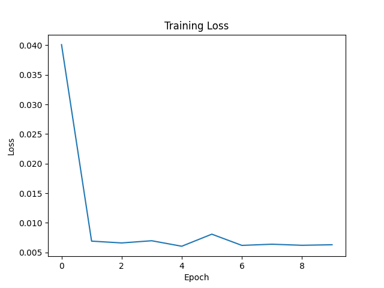

# 🧠 Neural Network From Scratch - House Price Prediction

**Built entirely from scratch with NumPy** — no PyTorch, no TensorFlow, no deep learning frameworks.

---

## 📌 Overview

This project implements a **regression neural network from scratch** to predict house prices. Every component is manually coded:

- ✅ Forward propagation
- ✅ Backpropagation (chain rule)
- ✅ Adam optimizer
- ✅ ReLU activation
- ✅ He weight initialization
- ✅ Mini-batch gradient descent

---

## 🎯 Key Results

| Metric | Result |
|--------|--------|
| **Training Loss Reduction** | 77% (0.040 → 0.0092) |
| **Test Loss** | 0.0104 |
| **R<sup>2</sup>** | 0.64824 |
| **RMSE** | 0.0962 |
| **MAE** | 0.0697|
| **Architecture** | 14 → 8 → 4 → 1 |

---

## 🧠 Architecture
Input (14 features)
↓
Hidden Layer 1 (8 neurons, ReLU)
↓
Hidden Layer 2 (4 neurons, ReLU)
↓
Output Layer (1 neuron)


---

## 🛠️ What I Built From Scratch

| Component | Implementation |
|-----------|----------------|
| **Forward Pass** | Matrix multiplication + bias + ReLU |
| **Backpropagation** | Chain rule derivatives |
| **Adam Optimizer** | Momentum + RMSprop from scratch |
| **ReLU Activation** | `max(0, x)` with derivative |
| **Weight Initialization** | He initialization (`√(2/n)`) |
| **Batch Training** | Mini-batch gradient descent (batch size 32) |

## 📊 Loss Reduction

```
Epoch: 0 Loss: 0.0401005385931033
Epoch: 100 Loss: 0.006917422878636654
Epoch: 200 Loss: 0.006612264429746065
Epoch: 300 Loss: 0.00698271926206127
Epoch: 400 Loss: 0.00605431790100587
Epoch: 500 Loss: 0.00809115911535003
Epoch: 600 Loss: 0.006196774441791512
Epoch: 700 Loss: 0.006395744105832059
Epoch: 800 Loss: 0.006214383004197252
Epoch: 900 Loss: 0.006306416134912575
```
## 📉 Loss Reduction Over Training

## 🚀 Quick Start

```bash
# Clone the repository
git clone https://github.com/ebukagerald/Neural-Network-From-Scratch.git
cd Neural-Network-From-Scratch

# Install dependencies
pip install numpy pandas

# Train the model
python train.py

📁 Project Structure
    housing-custom-nn/
    ├── model.py          # Neural network architecture
    ├── train.py          # Training loop
    ├── backward_propagation.py       # Manual backpropagation
    ├── adam_optimizer.py           # Adam optimizer from scratch
    ├── relu_activate.py           # ReLU activation
    ├── data/   # Dataset
    ├── Dataset_processing       #
    └── README.md

💡 Why This Matters
    Most ML engineers use frameworks like PyTorch or TensorFlow. I built the math behind them.
    
    This project demonstrates:
    
    Deep understanding of neural networks
    
    Mathematical foundations of deep learning
    
    Ability to implement complex algorithms from scratch
    
    Strong Python and NumPy skills

🛠️ Tech Stack
    Language: Python
    
    Libraries: NumPy, Pandas
    
    No frameworks: Everything is custom

🔗 Links
    GitHub: github.com/ebukagerald/housing-custom-nn
    LinkedIn: linkedin.com/in/ebukagerald
    
    Built with ❤️ by Ebuka Gerald | Expert ML Engineer

